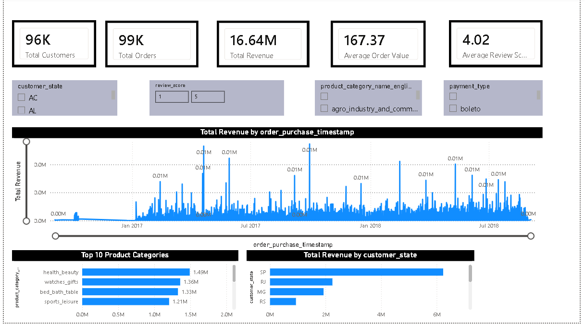
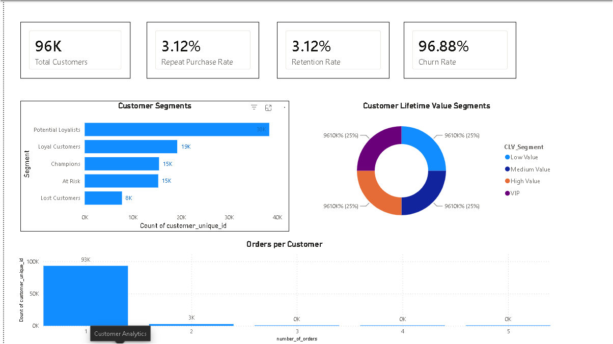
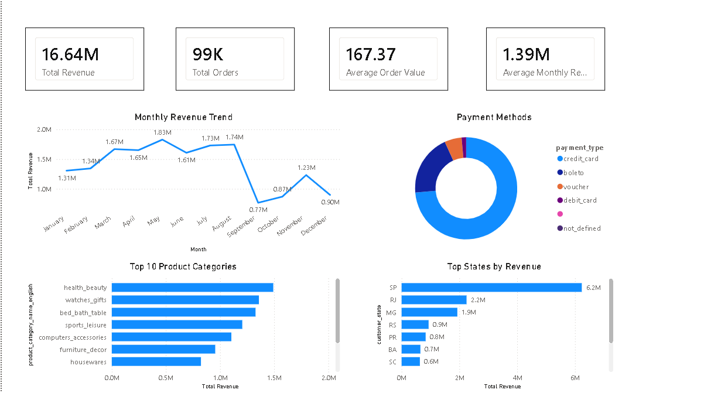
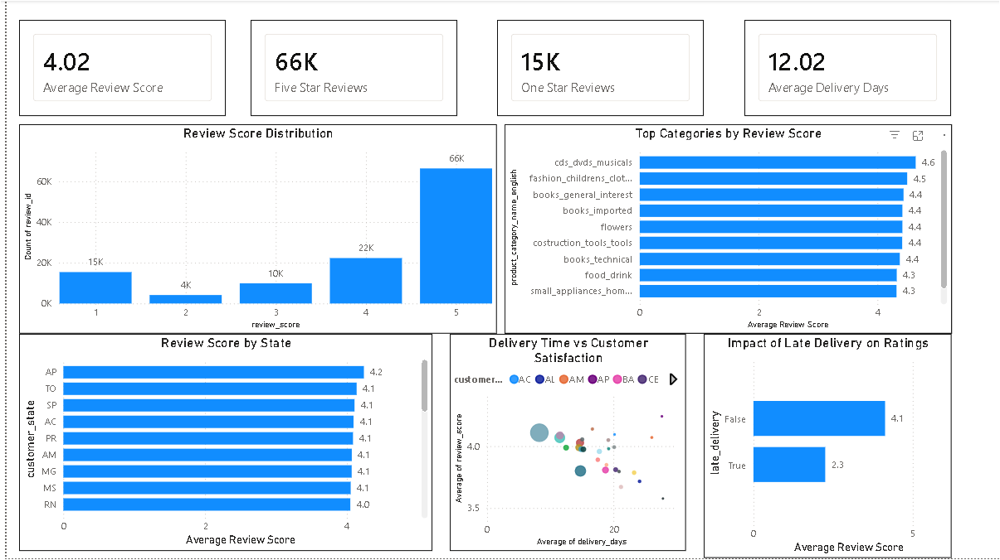
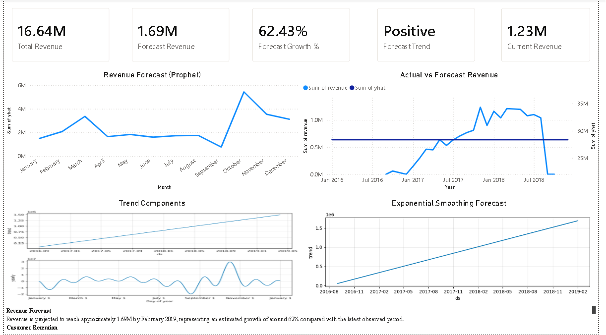
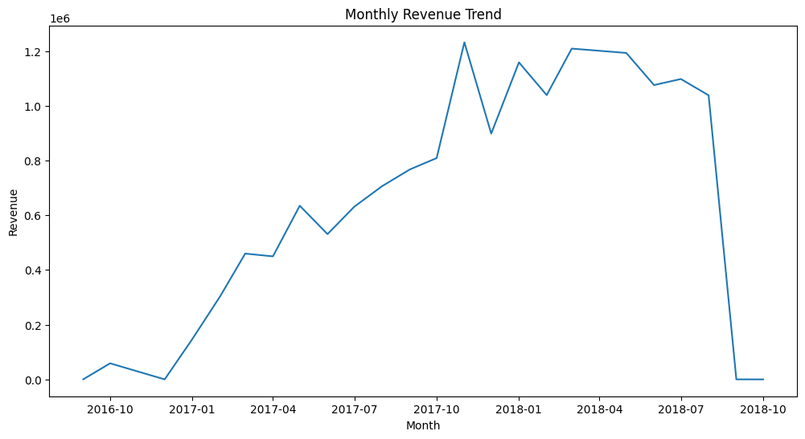
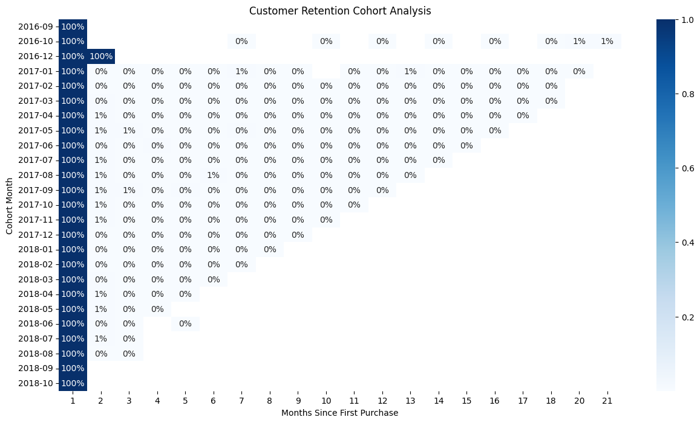
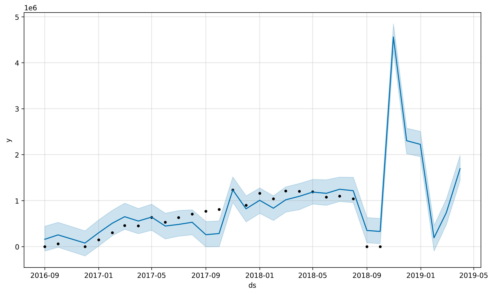
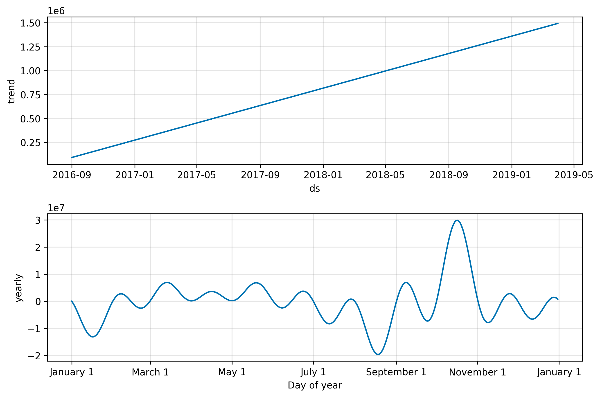

# 📊 E-Commerce Sales Intelligence Dashboard

<p align="center">


</p>

---

# 🚀 Project Overview

This project provides an end-to-end analysis of an e-commerce dataset containing approximately **100,000 orders**. The objective is to uncover customer behavior, sales trends, product performance, customer lifetime value, retention patterns, and future revenue forecasts using Python, SQL, Machine Learning, and Power BI.

### Business Questions Answered

- Which product categories generate the highest revenue?
- Which states contribute the most sales?
- What customer segments are most valuable?
- How strong is customer retention?
- What drives customer satisfaction?
- How will revenue perform in the coming months?

---

# 🛠 Tools & Technologies

## Programming

- Python
- Pandas
- NumPy

## Visualization

- Matplotlib
- Power BI

## Machine Learning

- Prophet
- Statsmodels
- Mlxtend

## Database

- SQL

## Development Environment

- VS Code
- Jupyter Notebook
- GitHub

---

# 📂 Project Structure

```text
Ecommerce-Sales-Intelligence
│
├── data
│     ├── raw
│     └── cleaned
│
├── notebook
│     ├── 01_data_understanding.ipynb
│     ├── 02_data_cleaning.ipynb
│     ├── 03_exploratory_analysis.ipynb
│     ├── 04_customer_segmentation.ipynb
│     ├── 07_cohort_analysis.ipynb
│     ├── 08_customer_retention_metrics.ipynb
│     ├── 09_customer_lifetime_value.ipynb
│     ├── 10_market_basket_analysis.ipynb
│     └── 11_forecasting.ipynb
│
├── sql
├── dashboard
├── images
├── reports
├── requirements.txt
└── README.md
```

---

# 📈 Exploratory Data Analysis

Performed analysis on:

- Revenue Trends
- Product Categories
- State-wise Revenue
- Review Scores
- Customer Segmentation
- Cohort Analysis
- Customer Lifetime Value
- Market Basket Analysis
- Forecasting

---

# 👥 Customer Analytics

### RFM Segmentation

Customers were grouped into:

- Champions
- Loyal Customers
- Potential Loyalists
- At Risk
- Lost Customers

### Customer Lifetime Value

Customers were classified into:

- VIP
- High Value
- Medium Value
- Low Value

### Retention Analysis

- Repeat Purchase Rate
- Churn Rate
- Retention Rate

---

# 🔮 Forecasting

Two forecasting approaches were implemented:

### Exponential Smoothing

Used to estimate future monthly revenue trends.

### Prophet Forecasting

Generated:

- Revenue Forecast
- Trend Components
- Growth Insights

Forecasted revenue reaches approximately **1.69 Million**.

---

# 📊 Power BI Dashboard Pages

## 1. Executive Overview



---

## 2. Customer Analytics



---

## 3. Sales Dashboard



---

## 4. Review Dashboard



---

## 5. Forecasting & Insights



---

# 📌 Key Insights

### Revenue Analysis

✅ Total Revenue exceeded **16.64 Million**

✅ Average Order Value is **167.37**

---

### Customer Behavior

✅ Majority of customers place one order.

✅ Potential Loyalists represent the largest customer segment.

✅ Churn rate is approximately **96.88%**.

---

### Product Performance

✅ Health & Beauty is the top-performing category.

✅ São Paulo generates the highest revenue.

---

### Customer Satisfaction

✅ Average review score is **4.02/5**.

✅ Late deliveries significantly reduce ratings.

---

### Forecasting

✅ Revenue shows a positive long-term trend.

✅ Prophet model predicts continued growth.

---

# 📷 Important Visualizations

### Monthly Revenue Trend



---

### Customer Segmentation


---

### Cohort Analysis



---

### Prophet Forecast



---

### Prophet Components



---

# ⚙ Installation

Clone the repository:

```bash
git clone https://github.com/abdulrehman-bbis/Ecommerce-Sales-Intelligence.git
```

Move into project directory:

```bash
cd Ecommerce-Sales-Intelligence
```

Install dependencies:

```bash
pip install -r requirements.txt
```

---

# ▶ Run Notebooks

Launch Jupyter:

```bash
jupyter notebook
```

Execute notebooks sequentially:

1. Data Understanding
2. Data Cleaning
3. Exploratory Analysis
4. Customer Segmentation
5. Cohort Analysis
6. Retention Metrics
7. Customer Lifetime Value
8. Market Basket Analysis
9. Forecasting

---

# 🔮 Future Improvements

- Streamlit Web App
- Interactive Deployment
- Recommendation System
- Customer Churn Prediction
- XGBoost Models
- Real-Time Dashboards

---

# 👨‍💻 Author

### Abdul Rehman

**Bachelor of Business and Information Systems (BBIS)**  
University of Management and Technology, Sialkot

### Skills

- Data Analytics
- Python
- SQL
- Power BI
- Machine Learning
- Forecasting
- Business Intelligence

### GitHub

https://github.com/abdulrehman-bbis

---

⭐ If you found this project useful, consider giving it a star.